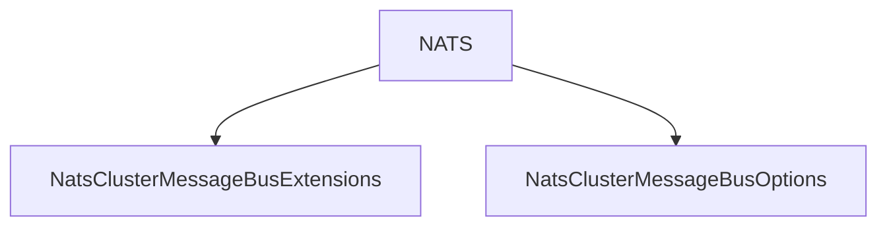

# NATS

## Contents

- [Overview](#overview)
- [Files](#files)
- [Types and Members](#types-and-members)
- [Serialization and Contracts](#serialization-and-contracts)
- [Validation and Constraints](#validation-and-constraints)
- [Performance Notes](#performance-notes)
- [Package Dependencies](#package-dependencies)
- [Diagrams](#diagrams)
- [Examples](#examples)
- [See Also](#see-also)

## Overview

The **NATS** area groups 2 documented types, including `NatsClusterMessageBusExtensions`, `NatsClusterMessageBusOptions`. It provides the contracts and implementation used by this part of ThunderPropagator.ClusterMessageBuses.

## Files

| File | Primary type(s)/symbol(s) | LOC (approx.) | Responsibility |
|---|---|---:|---|
| `AssemblyInfo.cs` | — | 4 | Contains the assembly info implementation or configuration. |
| `INatsClusterTransport.cs` | `INatsClusterTransport` | 29 | Defines INatsClusterTransport and its related behavior. |
| `NatsClusterDelivery.cs` | `NatsClusterDelivery` | 15 | Defines NatsClusterDelivery and its related behavior. |
| `NatsClusterMessageBus.cs` | `NatsClusterMessageBus`, `Log` | 153 | Defines NatsClusterMessageBus, Log and its related behavior. |
| `NatsClusterMessageBus.FanOut.cs` | `NatsClusterMessageBus`, `FanOutSubscription`, `Log` | 139 | Defines NatsClusterMessageBus, FanOutSubscription, Log and its related behavior. |
| `NatsClusterMessageBus.RequestReply.cs` | `NatsClusterMessageBus`, `Log` | 156 | Defines NatsClusterMessageBus, Log and its related behavior. |
| `NatsClusterMessageBus.Snapshots.cs` | `NatsClusterMessageBus`, `Log` | 96 | Defines NatsClusterMessageBus, Log and its related behavior. |
| `NatsClusterMessageBus.SubscriptionFetch.cs` | `NatsClusterMessageBus`, `Log` | 42 | Defines NatsClusterMessageBus, Log and its related behavior. |
| `NatsClusterMessageBus.SubscriptionSync.cs` | `NatsClusterMessageBus`, `SubscriptionEventSubscription`, `Log` | 136 | Defines NatsClusterMessageBus, SubscriptionEventSubscription, Log and its related behavior. |
| `NatsClusterMessageBusExtensions.cs` | `NatsClusterMessageBusExtensions` | 48 | Defines NatsClusterMessageBusExtensions and its related behavior. |
| `NatsClusterMessageBusOptions.cs` | `NatsClusterMessageBusOptions` | 28 | Defines NatsClusterMessageBusOptions and its related behavior. |
| `NatsClusterRequestEnvelope.cs` | `NatsClusterRequestEnvelope` | 33 | Defines NatsClusterRequestEnvelope and its related behavior. |
| `NatsClusterRequestKind.cs` | `NatsClusterRequestKind` | 13 | Defines NatsClusterRequestKind and its related behavior. |
| `NatsClusterResponseEnvelope.cs` | `NatsClusterResponseEnvelope` | 22 | Defines NatsClusterResponseEnvelope and its related behavior. |
| `NatsClusterTransport.cs` | `NatsClusterTransport` | 48 | Defines NatsClusterTransport and its related behavior. |
| `NatsSnapshotDeltaPayload.cs` | `NatsSnapshotDeltaPayload` | 15 | Defines NatsSnapshotDeltaPayload and its related behavior. |
| `NatsSubjectNaming.cs` | `NatsSubjectNaming` | 54 | Defines NatsSubjectNaming and its related behavior. |
| `ThunderPropagator.ClusterMessageBuses.NATS.csproj` | — | 13 | Defines project build targets, dependencies, and package metadata. |

## Types and Members

| Type | Kind | Summary | Inherits/Implements | Key Members |
|---|---|---|---|---|
| [`NatsClusterMessageBusExtensions`](#natsclustermessagebusextensions) | class | DI registration for the NATS transport. | — | `AddClusterNatsMessageBus(…)` |
| [`NatsClusterMessageBusOptions`](#natsclustermessagebusoptions) | class | Configuration for . | — | `Url`, `SubjectPrefix`, `RequestTimeout` |

### NatsClusterMessageBusExtensions

- **Kind:** class
- **Namespace:** `ThunderPropagator.ClusterMessageBuses.NATS`
- **Inherits/implements:** None declared
- **Attributes:** None detected
- **Key members:** `AddClusterNatsMessageBus(…)`
- **Summary:** DI registration for the NATS transport.
- **Thread safety:** Follow the lifetime and concurrency guarantees of the owning component; no additional guarantee is inferred.

**Usage recipe**

```csharp
// Resolve NatsClusterMessageBusExtensions from the configured service container or construct it with its declared dependencies.
```

[↑ Back to top](#contents)

### NatsClusterMessageBusOptions

- **Kind:** class
- **Namespace:** `ThunderPropagator.ClusterMessageBuses.NATS`
- **Inherits/implements:** None declared
- **Attributes:** None detected
- **Key members:** `Url`, `SubjectPrefix`, `RequestTimeout`
- **Summary:** Configuration for .
- **Thread safety:** Follow the lifetime and concurrency guarantees of the owning component; no additional guarantee is inferred.

**Usage recipe**

```csharp
// Resolve NatsClusterMessageBusOptions from the configured service container or construct it with its declared dependencies.
```

[↑ Back to top](#contents)

## Serialization and Contracts

Serialization behavior is part of the public wire or persistence contract in this area. Preserve field names, ordering rules, content negotiation, and backward-compatibility expectations when changing these types.

## Validation and Constraints

Inputs are validated at component boundaries. Callers should provide non-null required values and handle domain or argument exceptions without retrying invalid requests unchanged.

## Performance Notes

This area contains performance-sensitive constructs such as pooled buffers, spans, asynchronous value types, or concurrent collections. Avoid unnecessary allocations and blocking calls on streaming or message-processing paths.

## Package Dependencies

| Package | Version | Description | Links |
|---|---|---|---|
| `Apache.NMS` | `2.2.0` | External dependency used by the repository. | [Registry](https://www.nuget.org/packages/Apache.NMS) |
| `Apache.NMS.ActiveMQ` | `2.2.0` | External dependency used by the repository. | [Registry](https://www.nuget.org/packages/Apache.NMS.ActiveMQ) |
| `AWSSDK.SimpleNotificationService` | `4.0.100.6` | External dependency used by the repository. | [Registry](https://www.nuget.org/packages/AWSSDK.SimpleNotificationService) |
| `AWSSDK.SQS` | `4.0.100.5` | External dependency used by the repository. | [Registry](https://www.nuget.org/packages/AWSSDK.SQS) |
| `Azure.Messaging.ServiceBus` | `7.20.2` | External dependency used by the repository. | [Registry](https://www.nuget.org/packages/Azure.Messaging.ServiceBus) |
| `Confluent.Kafka` | `2.15.0` | External dependency used by the repository. | [Registry](https://www.nuget.org/packages/Confluent.Kafka) |
| `DotPulsar` | `5.3.1` | External dependency used by the repository. | [Registry](https://www.nuget.org/packages/DotPulsar) |
| `Microsoft.Extensions.Logging.Abstractions` | `10.*` | External dependency used by the repository. | [Registry](https://www.nuget.org/packages/Microsoft.Extensions.Logging.Abstractions) |
| `Microsoft.Extensions.Options` | `10.*` | External dependency used by the repository. | [Registry](https://www.nuget.org/packages/Microsoft.Extensions.Options) |
| `MQTTnet` | `5.2.0.1603` | External dependency used by the repository. | [Registry](https://www.nuget.org/packages/MQTTnet) |
| `NATS.Net` | `3.0.1` | External dependency used by the repository. | [Registry](https://www.nuget.org/packages/NATS.Net) |
| `Polly.Core` | `8.6.4` | External dependency used by the repository. | [Registry](https://www.nuget.org/packages/Polly.Core) |
| `RabbitMQ.Client` | `7.2.1` | External dependency used by the repository. | [Registry](https://www.nuget.org/packages/RabbitMQ.Client) |
| `StackExchange.Redis` | `3.0.17` | External dependency used by the repository. | [Registry](https://www.nuget.org/packages/StackExchange.Redis) |

## Diagrams

### Component overview



The diagram shows the direct components documented by the **NATS** area.

## Examples

Start with `NatsClusterMessageBusExtensions` as the primary entry point for this folder, then follow its linked contracts and collaborators.

## See Also

- [Documentation home](../README.md)
- [ActiveMQ](../ActiveMQ/README.md)
- [AwsSqs](../AwsSqs/README.md)
- [AzureServiceBus](../AzureServiceBus/README.md)
- [Kafka](../Kafka/README.md)
- [Mqtt](../Mqtt/README.md)
- [Pulsar](../Pulsar/README.md)
- [RabbitMQ](../RabbitMQ/README.md)
- [RedisPubSub](../RedisPubSub/README.md)
- [SharedKernel](../SharedKernel/README.md)
- [TcpSocket](../TcpSocket/README.md)
- [UdpClient](../UdpClient/README.md)
- [WebApi](../WebApi/README.md)
- [WebSocket](../WebSocket/README.md)

[↑ Back to top](#contents)
