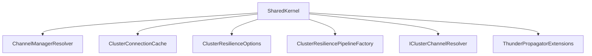

# SharedKernel

## Contents

- [Overview](#overview)
- [Files](#files)
- [Types and Members](#types-and-members)
- [Validation and Constraints](#validation-and-constraints)
- [Performance Notes](#performance-notes)
- [Package Dependencies](#package-dependencies)
- [Diagrams](#diagrams)
- [Examples](#examples)
- [See Also](#see-also)

## Overview

The **SharedKernel** area groups 6 documented types, including `ChannelManagerResolver`, `ClusterConnectionCache`, `ClusterResilienceOptions`, `ClusterResiliencePipelineFactory`, `IClusterChannelResolver`. It provides the contracts and implementation used by this part of ThunderPropagator.ClusterMessageBuses.

## Files

| File | Primary type(s)/symbol(s) | LOC (approx.) | Responsibility |
|---|---|---:|---|
| `AssemblyInfo.cs` | — | 4 | Contains the assembly info implementation or configuration. |
| `ChannelManagerResolver.cs` | `ChannelManagerResolver` | 23 | Defines ChannelManagerResolver and its related behavior. |
| `ClusterConnectionCache.cs` | `ClusterConnectionCache` | 107 | Defines ClusterConnectionCache and its related behavior. |
| `ClusterResilienceOptions.cs` | `ClusterResilienceOptions` | 32 | Defines ClusterResilienceOptions and its related behavior. |
| `ClusterResiliencePipelineFactory.cs` | `ClusterResiliencePipelineFactory` | 47 | Defines ClusterResiliencePipelineFactory and its related behavior. |
| `IClusterChannelResolver.cs` | `IClusterChannelResolver` | 25 | Defines IClusterChannelResolver and its related behavior. |
| `ThunderPropagator.ClusterMessageBuses.SharedKernel.csproj` | — | 7 | Defines project build targets, dependencies, and package metadata. |
| `ThunderPropagatorExtensions.cs` | `ThunderPropagatorExtensions` | 27 | Defines ThunderPropagatorExtensions and its related behavior. |

## Types and Members

| Type | Kind | Summary | Inherits/Implements | Key Members |
|---|---|---|---|---|
| [`ChannelManagerResolver`](#channelmanagerresolver) | class | Production — delegates straight to the real, DI-registered singleton. | `IClusterChannelResolver` | `GetChannel(…)`, `GetChannel(…)` |
| [`ClusterConnectionCache`](#clusterconnectioncache) | class | Generic keyed cache for expensive-to-construct cluster transport connections/clients (a gRPC channel, a ZeroMQ socket, a broker client, ...), shared across every IClusterMessageBus instance pointed at the same peer or endpoint instead of connecting once per instance. Generalizes the dedup-by-key, retry-after-failure pattern established by RedisConnectionMultiplexerCache / MongoClientCache in ThunderPropagator.RecoveryHandlers so every transport project in this repo can reuse it instead of reimplementing the same cache. | `IAsyncDisposable` | `GetOrCreateAsync(…)`, `DisposeAsync(…)` |
| [`ClusterResilienceOptions`](#clusterresilienceoptions) | class | Configures the retry and circuit-breaker behavior built by . Defaults are sensible for a peer-to-peer cluster connection — a few quick retries, then a short circuit-open window so a persistently unreachable peer doesn't get hammered. | — | `MaxRetryAttempts`, `RetryBaseDelay`, `CircuitBreakerFailureRatio`, `CircuitBreakerSamplingDuration`, `CircuitBreakerMinimumThroughput`, `CircuitBreakerBreakDuration` |
| [`ClusterResiliencePipelineFactory`](#clusterresiliencepipelinefactory) | class | Builds a transport-agnostic (retry with exponential backoff, plus a circuit breaker) for cluster transport implementations to wrap per-peer operations in. Deliberately built directly on Polly.Core rather than Microsoft.Extensions.Http.Resilience / Microsoft.Extensions.Http.Polly — those packages are HttpClient-specific and don't apply to gRPC streams, ZeroMQ sockets, or broker connections. Every transport project should build its per-peer resilience pipeline through this factory instead of hand-rolling retry loops, so behavior stays consistent across transports. | — | `Create(…)` |
| [`IClusterChannelResolver`](#iclusterchannelresolver) | interface | Resolves a live local by name or key when a transport answers a peer's broker-native (or direct) request. A thin seam over : that class is sealed in Release builds with non-virtual members, so it can't be substituted directly in tests — is the only production implementation, and every transport's tests fake this interface instead. Shared here (rather than duplicated per transport) since every transport in this repo needs exactly the same seam. | — | — |
| [`ThunderPropagatorExtensions`](#thunderpropagatorextensions) | class | Shared dependency-injection helpers used by every transport project in this repo. | — | — |

### ChannelManagerResolver

- **Kind:** class
- **Namespace:** `ThunderPropagator.ClusterMessageBuses.SharedKernel`
- **Inherits/implements:** `IClusterChannelResolver`
- **Attributes:** None detected
- **Key members:** `GetChannel(…)`, `GetChannel(…)`
- **Summary:** Production — delegates straight to the real, DI-registered singleton.
- **Thread safety:** Follow the lifetime and concurrency guarantees of the owning component; no additional guarantee is inferred.

**Usage recipe**

```csharp
// Resolve ChannelManagerResolver from the configured service container or construct it with its declared dependencies.
```

[↑ Back to top](#contents)

### ClusterConnectionCache

- **Kind:** class
- **Namespace:** `ThunderPropagator.ClusterMessageBuses.SharedKernel`
- **Inherits/implements:** `IAsyncDisposable`
- **Attributes:** None detected
- **Key members:** `GetOrCreateAsync(…)`, `DisposeAsync(…)`
- **Summary:** Generic keyed cache for expensive-to-construct cluster transport connections/clients (a gRPC channel, a ZeroMQ socket, a broker client, ...), shared across every IClusterMessageBus instance pointed at the same peer or endpoint instead of connecting once per instance. Generalizes the dedup-by-key, retry-after-failure pattern established by RedisConnectionMultiplexerCache / MongoClientCache in ThunderPropagator.RecoveryHandlers so every transport project in this repo can reuse it instead of reimplementing the same cache.
- **Thread safety:** Follow the lifetime and concurrency guarantees of the owning component; no additional guarantee is inferred.

**Usage recipe**

```csharp
// Resolve ClusterConnectionCache from the configured service container or construct it with its declared dependencies.
```

[↑ Back to top](#contents)

### ClusterResilienceOptions

- **Kind:** class
- **Namespace:** `ThunderPropagator.ClusterMessageBuses.SharedKernel`
- **Inherits/implements:** None declared
- **Attributes:** None detected
- **Key members:** `MaxRetryAttempts`, `RetryBaseDelay`, `CircuitBreakerFailureRatio`, `CircuitBreakerSamplingDuration`, `CircuitBreakerMinimumThroughput`, `CircuitBreakerBreakDuration`
- **Summary:** Configures the retry and circuit-breaker behavior built by . Defaults are sensible for a peer-to-peer cluster connection — a few quick retries, then a short circuit-open window so a persistently unreachable peer doesn't get hammered.
- **Thread safety:** Follow the lifetime and concurrency guarantees of the owning component; no additional guarantee is inferred.

**Usage recipe**

```csharp
// Resolve ClusterResilienceOptions from the configured service container or construct it with its declared dependencies.
```

[↑ Back to top](#contents)

### ClusterResiliencePipelineFactory

- **Kind:** class
- **Namespace:** `ThunderPropagator.ClusterMessageBuses.SharedKernel`
- **Inherits/implements:** None declared
- **Attributes:** None detected
- **Key members:** `Create(…)`
- **Summary:** Builds a transport-agnostic (retry with exponential backoff, plus a circuit breaker) for cluster transport implementations to wrap per-peer operations in. Deliberately built directly on Polly.Core rather than Microsoft.Extensions.Http.Resilience / Microsoft.Extensions.Http.Polly — those packages are HttpClient-specific and don't apply to gRPC streams, ZeroMQ sockets, or broker connections. Every transport project should build its per-peer resilience pipeline through this factory instead of hand-rolling retry loops, so behavior stays consistent across transports.
- **Thread safety:** Follow the lifetime and concurrency guarantees of the owning component; no additional guarantee is inferred.

**Usage recipe**

```csharp
// Resolve ClusterResiliencePipelineFactory from the configured service container or construct it with its declared dependencies.
```

[↑ Back to top](#contents)

### IClusterChannelResolver

- **Kind:** interface
- **Namespace:** `ThunderPropagator.ClusterMessageBuses.SharedKernel`
- **Inherits/implements:** None declared
- **Attributes:** None detected
- **Key members:** Refer to the API surface in the source package
- **Summary:** Resolves a live local by name or key when a transport answers a peer's broker-native (or direct) request. A thin seam over : that class is sealed in Release builds with non-virtual members, so it can't be substituted directly in tests — is the only production implementation, and every transport's tests fake this interface instead. Shared here (rather than duplicated per transport) since every transport in this repo needs exactly the same seam.
- **Thread safety:** Follow the lifetime and concurrency guarantees of the owning component; no additional guarantee is inferred.

**Usage recipe**

```csharp
// Resolve IClusterChannelResolver from the configured service container or construct it with its declared dependencies.
```

[↑ Back to top](#contents)

### ThunderPropagatorExtensions

- **Kind:** class
- **Namespace:** `ThunderPropagator.ClusterMessageBuses.SharedKernel`
- **Inherits/implements:** None declared
- **Attributes:** None detected
- **Key members:** Refer to the API surface in the source package
- **Summary:** Shared dependency-injection helpers used by every transport project in this repo.
- **Thread safety:** Follow the lifetime and concurrency guarantees of the owning component; no additional guarantee is inferred.

**Usage recipe**

```csharp
// Resolve ThunderPropagatorExtensions from the configured service container or construct it with its declared dependencies.
```

[↑ Back to top](#contents)

## Validation and Constraints

Inputs are validated at component boundaries. Callers should provide non-null required values and handle domain or argument exceptions without retrying invalid requests unchanged.

## Performance Notes

This area contains performance-sensitive constructs such as pooled buffers, spans, asynchronous value types, or concurrent collections. Avoid unnecessary allocations and blocking calls on streaming or message-processing paths.

## Package Dependencies

| Package | Version | Description | Links |
|---|---|---|---|
| `Apache.NMS` | `2.2.0` | External dependency used by the repository. | [Registry](https://www.nuget.org/packages/Apache.NMS) |
| `Apache.NMS.ActiveMQ` | `2.2.0` | External dependency used by the repository. | [Registry](https://www.nuget.org/packages/Apache.NMS.ActiveMQ) |
| `AWSSDK.SimpleNotificationService` | `4.0.100.6` | External dependency used by the repository. | [Registry](https://www.nuget.org/packages/AWSSDK.SimpleNotificationService) |
| `AWSSDK.SQS` | `4.0.100.5` | External dependency used by the repository. | [Registry](https://www.nuget.org/packages/AWSSDK.SQS) |
| `Azure.Messaging.ServiceBus` | `7.20.2` | External dependency used by the repository. | [Registry](https://www.nuget.org/packages/Azure.Messaging.ServiceBus) |
| `Confluent.Kafka` | `2.15.0` | External dependency used by the repository. | [Registry](https://www.nuget.org/packages/Confluent.Kafka) |
| `DotPulsar` | `5.3.1` | External dependency used by the repository. | [Registry](https://www.nuget.org/packages/DotPulsar) |
| `Microsoft.Extensions.Logging.Abstractions` | `10.*` | External dependency used by the repository. | [Registry](https://www.nuget.org/packages/Microsoft.Extensions.Logging.Abstractions) |
| `Microsoft.Extensions.Options` | `10.*` | External dependency used by the repository. | [Registry](https://www.nuget.org/packages/Microsoft.Extensions.Options) |
| `MQTTnet` | `5.2.0.1603` | External dependency used by the repository. | [Registry](https://www.nuget.org/packages/MQTTnet) |
| `NATS.Net` | `3.0.1` | External dependency used by the repository. | [Registry](https://www.nuget.org/packages/NATS.Net) |
| `Polly.Core` | `8.6.4` | External dependency used by the repository. | [Registry](https://www.nuget.org/packages/Polly.Core) |
| `RabbitMQ.Client` | `7.2.1` | External dependency used by the repository. | [Registry](https://www.nuget.org/packages/RabbitMQ.Client) |
| `StackExchange.Redis` | `3.0.17` | External dependency used by the repository. | [Registry](https://www.nuget.org/packages/StackExchange.Redis) |

## Diagrams

### Component overview



The diagram shows the direct components documented by the **SharedKernel** area.

## Examples

Start with `ChannelManagerResolver` as the primary entry point for this folder, then follow its linked contracts and collaborators.

## See Also

- [Documentation home](../README.md)
- [ActiveMQ](../ActiveMQ/README.md)
- [AwsSqs](../AwsSqs/README.md)
- [AzureServiceBus](../AzureServiceBus/README.md)
- [Kafka](../Kafka/README.md)
- [Mqtt](../Mqtt/README.md)
- [NATS](../NATS/README.md)
- [Pulsar](../Pulsar/README.md)
- [RabbitMQ](../RabbitMQ/README.md)
- [RedisPubSub](../RedisPubSub/README.md)
- [TcpSocket](../TcpSocket/README.md)
- [UdpClient](../UdpClient/README.md)
- [WebApi](../WebApi/README.md)
- [WebSocket](../WebSocket/README.md)

[↑ Back to top](#contents)
