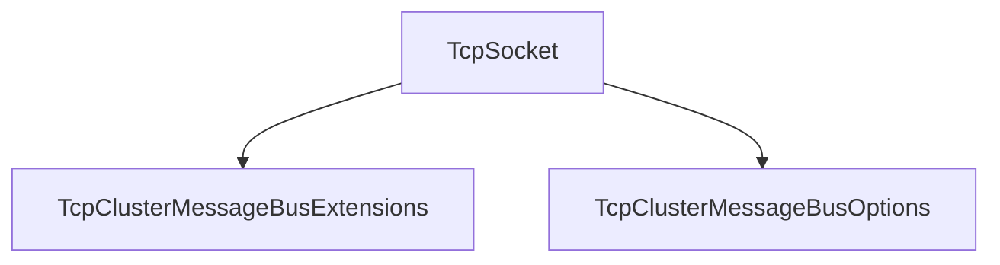

# TcpSocket

## Contents

- [Overview](#overview)
- [Files](#files)
- [Types and Members](#types-and-members)
- [Serialization and Contracts](#serialization-and-contracts)
- [Validation and Constraints](#validation-and-constraints)
- [Performance Notes](#performance-notes)
- [Package Dependencies](#package-dependencies)
- [Diagrams](#diagrams)
- [Examples](#examples)
- [See Also](#see-also)

## Overview

The **TcpSocket** area groups 2 documented types, including `TcpClusterMessageBusExtensions`, `TcpClusterMessageBusOptions`. It provides the contracts and implementation used by this part of ThunderPropagator.ClusterMessageBuses.

## Files

| File | Primary type(s)/symbol(s) | LOC (approx.) | Responsibility |
|---|---|---:|---|
| `AssemblyInfo.cs` | — | 4 | Contains the assembly info implementation or configuration. |
| `ITcpClusterConnection.cs` | `ITcpClusterConnection` | 21 | Defines ITcpClusterConnection and its related behavior. |
| `ITcpClusterListener.cs` | `ITcpClusterListener` | 21 | Defines ITcpClusterListener and its related behavior. |
| `NetworkStreamTcpClusterConnection.cs` | `NetworkStreamTcpClusterConnection` | 136 | Defines NetworkStreamTcpClusterConnection and its related behavior. |
| `TcpClusterFrame.cs` | `TcpClusterFrame` | 13 | Defines TcpClusterFrame and its related behavior. |
| `TcpClusterFrameKind.cs` | `TcpClusterFrameKind` | 16 | Defines TcpClusterFrameKind and its related behavior. |
| `TcpClusterMessageBus.cs` | `TcpClusterMessageBus`, `Log` | 282 | Defines TcpClusterMessageBus, Log and its related behavior. |
| `TcpClusterMessageBus.FanOut.cs` | `TcpClusterMessageBus`, `FanOutSubscription`, `Log` | 103 | Defines TcpClusterMessageBus, FanOutSubscription, Log and its related behavior. |
| `TcpClusterMessageBus.RequestReply.cs` | `TcpClusterMessageBus`, `Log` | 186 | Defines TcpClusterMessageBus, Log and its related behavior. |
| `TcpClusterMessageBus.Snapshots.cs` | `TcpClusterMessageBus`, `Log` | 96 | Defines TcpClusterMessageBus, Log and its related behavior. |
| `TcpClusterMessageBus.SubscriptionFetch.cs` | `TcpClusterMessageBus`, `Log` | 42 | Defines TcpClusterMessageBus, Log and its related behavior. |
| `TcpClusterMessageBus.SubscriptionSync.cs` | `TcpClusterMessageBus`, `SubscriptionEventSubscription`, `Log` | 102 | Defines TcpClusterMessageBus, SubscriptionEventSubscription, Log and its related behavior. |
| `TcpClusterMessageBusExtensions.cs` | `TcpClusterMessageBusExtensions` | 56 | Defines TcpClusterMessageBusExtensions and its related behavior. |
| `TcpClusterMessageBusOptions.cs` | `TcpClusterMessageBusOptions` | 29 | Defines TcpClusterMessageBusOptions and its related behavior. |
| `TcpClusterRequestEnvelope.cs` | `TcpClusterRequestEnvelope` | 19 | Defines TcpClusterRequestEnvelope and its related behavior. |
| `TcpClusterRequestKind.cs` | `TcpClusterRequestKind` | 13 | Defines TcpClusterRequestKind and its related behavior. |
| `TcpClusterResponseEnvelope.cs` | `TcpClusterResponseEnvelope` | 24 | Defines TcpClusterResponseEnvelope and its related behavior. |
| `TcpFanOutPayload.cs` | `TcpFanOutPayload` | 7 | Defines TcpFanOutPayload and its related behavior. |
| `TcpListenerClusterListener.cs` | `TcpListenerClusterListener` | 55 | Defines TcpListenerClusterListener and its related behavior. |
| `TcpSnapshotDeltaPayload.cs` | `TcpSnapshotDeltaPayload` | 15 | Defines TcpSnapshotDeltaPayload and its related behavior. |
| `TcpSubscriptionEventPayload.cs` | `TcpSubscriptionEventPayload` | 7 | Defines TcpSubscriptionEventPayload and its related behavior. |
| `ThunderPropagator.ClusterMessageBuses.TcpSocket.csproj` | — | 12 | Defines project build targets, dependencies, and package metadata. |

## Types and Members

| Type | Kind | Summary | Inherits/Implements | Key Members |
|---|---|---|---|---|
| [`TcpClusterMessageBusExtensions`](#tcpclustermessagebusextensions) | class | DI registration for the raw-TCP direct-peer-connection transport. | — | `AddClusterTcpMessageBus(…)` |
| [`TcpClusterMessageBusOptions`](#tcpclustermessagebusoptions) | class | Configuration for . | — | `Port`, `RequestTimeout`, `MaxFrameSize` |

### TcpClusterMessageBusExtensions

- **Kind:** class
- **Namespace:** `ThunderPropagator.ClusterMessageBuses.TcpSocket`
- **Inherits/implements:** None declared
- **Attributes:** None detected
- **Key members:** `AddClusterTcpMessageBus(…)`
- **Summary:** DI registration for the raw-TCP direct-peer-connection transport.
- **Thread safety:** Follow the lifetime and concurrency guarantees of the owning component; no additional guarantee is inferred.

**Usage recipe**

```csharp
// Resolve TcpClusterMessageBusExtensions from the configured service container or construct it with its declared dependencies.
```

[↑ Back to top](#contents)

### TcpClusterMessageBusOptions

- **Kind:** class
- **Namespace:** `ThunderPropagator.ClusterMessageBuses.TcpSocket`
- **Inherits/implements:** None declared
- **Attributes:** None detected
- **Key members:** `Port`, `RequestTimeout`, `MaxFrameSize`
- **Summary:** Configuration for .
- **Thread safety:** Follow the lifetime and concurrency guarantees of the owning component; no additional guarantee is inferred.

**Usage recipe**

```csharp
// Resolve TcpClusterMessageBusOptions from the configured service container or construct it with its declared dependencies.
```

[↑ Back to top](#contents)

## Serialization and Contracts

Serialization behavior is part of the public wire or persistence contract in this area. Preserve field names, ordering rules, content negotiation, and backward-compatibility expectations when changing these types.

## Validation and Constraints

Inputs are validated at component boundaries. Callers should provide non-null required values and handle domain or argument exceptions without retrying invalid requests unchanged.

## Performance Notes

This area contains performance-sensitive constructs such as pooled buffers, spans, asynchronous value types, or concurrent collections. Avoid unnecessary allocations and blocking calls on streaming or message-processing paths.

## Package Dependencies

| Package | Version | Description | Links |
|---|---|---|---|
| `Apache.NMS` | `2.2.0` | External dependency used by the repository. | [Registry](https://www.nuget.org/packages/Apache.NMS) |
| `Apache.NMS.ActiveMQ` | `2.2.0` | External dependency used by the repository. | [Registry](https://www.nuget.org/packages/Apache.NMS.ActiveMQ) |
| `AWSSDK.SimpleNotificationService` | `4.0.100.6` | External dependency used by the repository. | [Registry](https://www.nuget.org/packages/AWSSDK.SimpleNotificationService) |
| `AWSSDK.SQS` | `4.0.100.5` | External dependency used by the repository. | [Registry](https://www.nuget.org/packages/AWSSDK.SQS) |
| `Azure.Messaging.ServiceBus` | `7.20.2` | External dependency used by the repository. | [Registry](https://www.nuget.org/packages/Azure.Messaging.ServiceBus) |
| `Confluent.Kafka` | `2.15.0` | External dependency used by the repository. | [Registry](https://www.nuget.org/packages/Confluent.Kafka) |
| `DotPulsar` | `5.3.1` | External dependency used by the repository. | [Registry](https://www.nuget.org/packages/DotPulsar) |
| `Microsoft.Extensions.Logging.Abstractions` | `10.*` | External dependency used by the repository. | [Registry](https://www.nuget.org/packages/Microsoft.Extensions.Logging.Abstractions) |
| `Microsoft.Extensions.Options` | `10.*` | External dependency used by the repository. | [Registry](https://www.nuget.org/packages/Microsoft.Extensions.Options) |
| `MQTTnet` | `5.2.0.1603` | External dependency used by the repository. | [Registry](https://www.nuget.org/packages/MQTTnet) |
| `NATS.Net` | `3.0.1` | External dependency used by the repository. | [Registry](https://www.nuget.org/packages/NATS.Net) |
| `Polly.Core` | `8.6.4` | External dependency used by the repository. | [Registry](https://www.nuget.org/packages/Polly.Core) |
| `RabbitMQ.Client` | `7.2.1` | External dependency used by the repository. | [Registry](https://www.nuget.org/packages/RabbitMQ.Client) |
| `StackExchange.Redis` | `3.0.17` | External dependency used by the repository. | [Registry](https://www.nuget.org/packages/StackExchange.Redis) |

## Diagrams

### Component overview



The diagram shows the direct components documented by the **TcpSocket** area.

## Examples

Start with `TcpClusterMessageBusExtensions` as the primary entry point for this folder, then follow its linked contracts and collaborators.

## See Also

- [Documentation home](../README.md)
- [ActiveMQ](../ActiveMQ/README.md)
- [AwsSqs](../AwsSqs/README.md)
- [AzureServiceBus](../AzureServiceBus/README.md)
- [Kafka](../Kafka/README.md)
- [Mqtt](../Mqtt/README.md)
- [NATS](../NATS/README.md)
- [Pulsar](../Pulsar/README.md)
- [RabbitMQ](../RabbitMQ/README.md)
- [RedisPubSub](../RedisPubSub/README.md)
- [SharedKernel](../SharedKernel/README.md)
- [UdpClient](../UdpClient/README.md)
- [WebApi](../WebApi/README.md)
- [WebSocket](../WebSocket/README.md)

[↑ Back to top](#contents)
