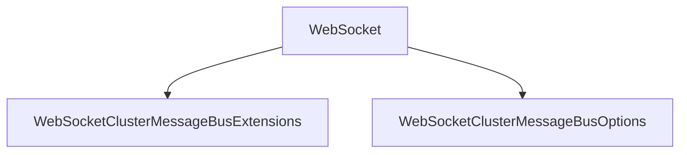

# WebSocket

## Contents

- [Overview](#overview)
- [Files](#files)
- [Types and Members](#types-and-members)
- [Serialization and Contracts](#serialization-and-contracts)
- [Validation and Constraints](#validation-and-constraints)
- [Performance Notes](#performance-notes)
- [Package Dependencies](#package-dependencies)
- [Diagrams](#diagrams)
- [Examples](#examples)
- [See Also](#see-also)

## Overview

The **WebSocket** area groups 2 documented types, including `WebSocketClusterMessageBusExtensions`, `WebSocketClusterMessageBusOptions`. It provides the contracts and implementation used by this part of ThunderPropagator.ClusterMessageBuses.

## Files

| File | Primary type(s)/symbol(s) | LOC (approx.) | Responsibility |
|---|---|---:|---|
| `AssemblyInfo.cs` | — | 4 | Contains the assembly info implementation or configuration. |
| `HttpListenerWebSocketClusterListener.cs` | `HttpListenerWebSocketClusterListener` | 80 | Defines HttpListenerWebSocketClusterListener and its related behavior. |
| `IWebSocketClusterListener.cs` | `IWebSocketClusterListener` | 22 | Defines IWebSocketClusterListener and its related behavior. |
| `ThunderPropagator.ClusterMessageBuses.WebSocket.csproj` | — | 12 | Defines project build targets, dependencies, and package metadata. |
| `WebSocketAddressing.cs` | `WebSocketAddressing` | 43 | Defines WebSocketAddressing and its related behavior. |
| `WebSocketClusterFrame.cs` | `WebSocketClusterFrame` | 12 | Defines WebSocketClusterFrame and its related behavior. |
| `WebSocketClusterFrameKind.cs` | `WebSocketClusterFrameKind` | 16 | Defines WebSocketClusterFrameKind and its related behavior. |
| `WebSocketClusterMessageBus.cs` | `WebSocketClusterMessageBus`, `Log` | 296 | Defines WebSocketClusterMessageBus, Log and its related behavior. |
| `WebSocketClusterMessageBus.FanOut.cs` | `WebSocketClusterMessageBus`, `FanOutSubscription`, `Log` | 105 | Defines WebSocketClusterMessageBus, FanOutSubscription, Log and its related behavior. |
| `WebSocketClusterMessageBus.RequestReply.cs` | `WebSocketClusterMessageBus`, `Log` | 187 | Defines WebSocketClusterMessageBus, Log and its related behavior. |
| `WebSocketClusterMessageBus.Snapshots.cs` | `WebSocketClusterMessageBus`, `Log` | 96 | Defines WebSocketClusterMessageBus, Log and its related behavior. |
| `WebSocketClusterMessageBus.SubscriptionFetch.cs` | `WebSocketClusterMessageBus`, `Log` | 42 | Defines WebSocketClusterMessageBus, Log and its related behavior. |
| `WebSocketClusterMessageBus.SubscriptionSync.cs` | `WebSocketClusterMessageBus`, `SubscriptionEventSubscription`, `Log` | 102 | Defines WebSocketClusterMessageBus, SubscriptionEventSubscription, Log and its related behavior. |
| `WebSocketClusterMessageBusExtensions.cs` | `WebSocketClusterMessageBusExtensions` | 55 | Defines WebSocketClusterMessageBusExtensions and its related behavior. |
| `WebSocketClusterMessageBusOptions.cs` | `WebSocketClusterMessageBusOptions` | 35 | Defines WebSocketClusterMessageBusOptions and its related behavior. |
| `WebSocketClusterRequestEnvelope.cs` | `WebSocketClusterRequestEnvelope` | 26 | Defines WebSocketClusterRequestEnvelope and its related behavior. |
| `WebSocketClusterRequestKind.cs` | `WebSocketClusterRequestKind` | 13 | Defines WebSocketClusterRequestKind and its related behavior. |
| `WebSocketClusterResponseEnvelope.cs` | `WebSocketClusterResponseEnvelope` | 24 | Defines WebSocketClusterResponseEnvelope and its related behavior. |
| `WebSocketFanOutPayload.cs` | `WebSocketFanOutPayload` | 7 | Defines WebSocketFanOutPayload and its related behavior. |
| `WebSocketPeerConnection.cs` | `WebSocketPeerConnection` | 130 | Defines WebSocketPeerConnection and its related behavior. |
| `WebSocketSnapshotDeltaPayload.cs` | `WebSocketSnapshotDeltaPayload` | 15 | Defines WebSocketSnapshotDeltaPayload and its related behavior. |
| `WebSocketSubscriptionEventPayload.cs` | `WebSocketSubscriptionEventPayload` | 7 | Defines WebSocketSubscriptionEventPayload and its related behavior. |

## Types and Members

| Type | Kind | Summary | Inherits/Implements | Key Members |
|---|---|---|---|---|
| [`WebSocketClusterMessageBusExtensions`](#websocketclustermessagebusextensions) | class | DI registration for the WebSocket direct-peer-connection transport. | — | `AddClusterWebSocketMessageBus(…)` |
| [`WebSocketClusterMessageBusOptions`](#websocketclustermessagebusoptions) | class | Configuration for . | — | `ListenPath`, `RequestTimeout`, `ReceiveBufferSize`, `ConfigureClientWebSocket` |

### WebSocketClusterMessageBusExtensions

- **Kind:** class
- **Namespace:** `ThunderPropagator.ClusterMessageBuses.WebSocket`
- **Inherits/implements:** None declared
- **Attributes:** None detected
- **Key members:** `AddClusterWebSocketMessageBus(…)`
- **Summary:** DI registration for the WebSocket direct-peer-connection transport.
- **Thread safety:** Follow the lifetime and concurrency guarantees of the owning component; no additional guarantee is inferred.

**Usage recipe**

```csharp
// Resolve WebSocketClusterMessageBusExtensions from the configured service container or construct it with its declared dependencies.
```

[↑ Back to top](#contents)

### WebSocketClusterMessageBusOptions

- **Kind:** class
- **Namespace:** `ThunderPropagator.ClusterMessageBuses.WebSocket`
- **Inherits/implements:** None declared
- **Attributes:** None detected
- **Key members:** `ListenPath`, `RequestTimeout`, `ReceiveBufferSize`, `ConfigureClientWebSocket`
- **Summary:** Configuration for .
- **Thread safety:** Follow the lifetime and concurrency guarantees of the owning component; no additional guarantee is inferred.

**Usage recipe**

```csharp
// Resolve WebSocketClusterMessageBusOptions from the configured service container or construct it with its declared dependencies.
```

[↑ Back to top](#contents)

## Serialization and Contracts

Serialization behavior is part of the public wire or persistence contract in this area. Preserve field names, ordering rules, content negotiation, and backward-compatibility expectations when changing these types.

## Validation and Constraints

Inputs are validated at component boundaries. Callers should provide non-null required values and handle domain or argument exceptions without retrying invalid requests unchanged.

## Performance Notes

This area contains performance-sensitive constructs such as pooled buffers, spans, asynchronous value types, or concurrent collections. Avoid unnecessary allocations and blocking calls on streaming or message-processing paths.

## Package Dependencies

| Package | Version | Description | Links |
|---|---|---|---|
| `Apache.NMS` | `2.2.0` | External dependency used by the repository. | [Registry](https://www.nuget.org/packages/Apache.NMS) |
| `Apache.NMS.ActiveMQ` | `2.2.0` | External dependency used by the repository. | [Registry](https://www.nuget.org/packages/Apache.NMS.ActiveMQ) |
| `AWSSDK.SimpleNotificationService` | `4.0.100.6` | External dependency used by the repository. | [Registry](https://www.nuget.org/packages/AWSSDK.SimpleNotificationService) |
| `AWSSDK.SQS` | `4.0.100.5` | External dependency used by the repository. | [Registry](https://www.nuget.org/packages/AWSSDK.SQS) |
| `Azure.Messaging.ServiceBus` | `7.20.2` | External dependency used by the repository. | [Registry](https://www.nuget.org/packages/Azure.Messaging.ServiceBus) |
| `Confluent.Kafka` | `2.15.0` | External dependency used by the repository. | [Registry](https://www.nuget.org/packages/Confluent.Kafka) |
| `DotPulsar` | `5.3.1` | External dependency used by the repository. | [Registry](https://www.nuget.org/packages/DotPulsar) |
| `Microsoft.Extensions.Logging.Abstractions` | `10.*` | External dependency used by the repository. | [Registry](https://www.nuget.org/packages/Microsoft.Extensions.Logging.Abstractions) |
| `Microsoft.Extensions.Options` | `10.*` | External dependency used by the repository. | [Registry](https://www.nuget.org/packages/Microsoft.Extensions.Options) |
| `MQTTnet` | `5.2.0.1603` | External dependency used by the repository. | [Registry](https://www.nuget.org/packages/MQTTnet) |
| `NATS.Net` | `3.0.1` | External dependency used by the repository. | [Registry](https://www.nuget.org/packages/NATS.Net) |
| `Polly.Core` | `8.6.4` | External dependency used by the repository. | [Registry](https://www.nuget.org/packages/Polly.Core) |
| `RabbitMQ.Client` | `7.2.1` | External dependency used by the repository. | [Registry](https://www.nuget.org/packages/RabbitMQ.Client) |
| `StackExchange.Redis` | `3.0.17` | External dependency used by the repository. | [Registry](https://www.nuget.org/packages/StackExchange.Redis) |

## Diagrams

### Component overview



The diagram shows the direct components documented by the **WebSocket** area.

## Examples

Start with `WebSocketClusterMessageBusExtensions` as the primary entry point for this folder, then follow its linked contracts and collaborators.

## See Also

- [Documentation home](../README.md)
- [ActiveMQ](../ActiveMQ/README.md)
- [AwsSqs](../AwsSqs/README.md)
- [AzureServiceBus](../AzureServiceBus/README.md)
- [Kafka](../Kafka/README.md)
- [Mqtt](../Mqtt/README.md)
- [NATS](../NATS/README.md)
- [Pulsar](../Pulsar/README.md)
- [RabbitMQ](../RabbitMQ/README.md)
- [RedisPubSub](../RedisPubSub/README.md)
- [SharedKernel](../SharedKernel/README.md)
- [TcpSocket](../TcpSocket/README.md)
- [UdpClient](../UdpClient/README.md)
- [WebApi](../WebApi/README.md)

[↑ Back to top](#contents)
